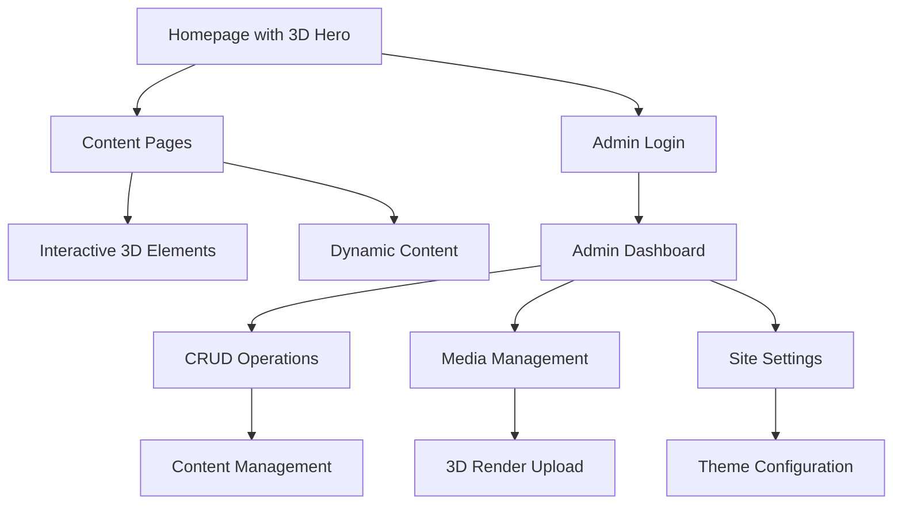

# Futuristic React Website - Product Requirements Document

## 1. Product Overview

A modern, futuristic React-based website featuring 3D-styled visuals and immersive user experience with glassmorphism effects, neon glows, and smooth animations. The platform will serve as a public-facing website with dynamic content management capabilities and an admin dashboard for full CRUD operations.

* **Primary Purpose**: Create a bold, immersive web experience with cutting-edge visual design and 3D elements

* **Target Audience**: Modern businesses and users seeking futuristic, interactive web experiences

* **Market Value**: Showcase advanced web development capabilities with Tesla dashboard and Apple Vision Pro inspired design aesthetics

## 2. Core Features

### 2.1 User Roles

| Role        | Registration Method      | Core Permissions                                                      |
| ----------- | ------------------------ | --------------------------------------------------------------------- |
| Public User | No registration required | Can browse website, interact with 3D elements, view content           |
| Admin User  | Admin login system       | Full CRUD access, content management, media management, site settings |

### 2.2 Feature Module

Our futuristic website consists of the following main pages:

1. **Homepage**: 3D hero section, interactive navigation, animated content cards, neon visual effects
2. **Content Pages**: Dynamic content display, glassmorphism containers, smooth transitions, 3D visual elements
3. **Admin Dashboard**: Modular admin panel, CRUD operations, media management, user role management
4. **Authentication**: Admin login system with session management and form validation
5. **Settings Page**: Site configuration, theme settings, dark mode toggle

### 2.3 Page Details

| Page Name       | Module Name        | Feature Description                                                            |
| --------------- | ------------------ | ------------------------------------------------------------------------------ |
| Homepage        | 3D Hero Section    | Interactive WebGL-based 3D renders, animated SVGs, immersive visual experience |
| Homepage        | Navigation System  | Futuristic navigation with hover effects, smooth transitions, neon highlights  |
| Homepage        | Content Cards      | Interactive cards with depth, glassmorphism effects, motion animations         |
| Content Pages   | Dynamic Content    | Database-driven content display with CRUD capabilities                         |
| Content Pages   | Visual Effects     | Neon glows, chrome textures, gradient backgrounds, soft shadows                |
| Content Pages   | Animation System   | Framer Motion/GSAP transitions, scroll-triggered animations                    |
| Admin Dashboard | CRUD Operations    | Create, read, update, delete for all content types                             |
| Admin Dashboard | Media Management   | Upload, organize, and manage images and 3D renders                             |
| Admin Dashboard | User Management    | Admin role management, session handling                                        |
| Admin Dashboard | Analytics          | Dashboard charts using Chart.js or ApexCharts                                  |
| Authentication  | Login System       | Secure admin authentication with session management                            |
| Authentication  | Form Validation    | Comprehensive validation with clear error messages                             |
| Settings        | Theme Control      | Dark mode toggle, color scheme management                                      |
| Settings        | Site Configuration | Global site settings, content management options                               |

## 3. Core Process

**Public User Flow:**
Users land on the futuristic homepage with 3D hero section → Navigate through content pages with smooth animations → Interact with 3D elements and glassmorphism UI → Experience immersive visual effects and transitions

**Admin User Flow:**
Admin logs in through authentication system → Access modular dashboard → Perform CRUD operations on content → Manage media and 3D renders → Configure site settings → Monitor analytics

## 4. User Interface Design

### 4.1 Design Style

* **Primary Colors**: Deep blue (#0F172A), neon green (#10B981), electric purple (#8B5CF6)

* **Secondary Colors**: Chrome silver (#E5E7EB), neon cyan (#06B6D4), dark gray (#1F2937)

* **Button Style**: Glassmorphism with neon borders, soft glows, hover depth effects

* **Typography**: Modern sans-serif fonts (Inter, Poppins), futuristic letter spacing

* **Layout Style**: Card-based with floating elements, asymmetric grids, depth layers

* **Icon Style**: Outlined neon icons, animated SVGs, 3D-styled elements

* **Effects**: Glassmorphism, neon glows, chrome textures, soft shadows, motion blur

### 4.2 Page Design Overview

| Page Name       | Module Name          | UI Elements                                                                 |
| --------------- | -------------------- | --------------------------------------------------------------------------- |
| Homepage        | 3D Hero Section      | WebGL canvas, floating particles, animated 3D models, neon circuit patterns |
| Homepage        | Navigation           | Transparent glass navbar, neon hover states, smooth slide animations        |
| Homepage        | Content Cards        | Glassmorphism containers, depth shadows, neon borders, hover lift effects   |
| Content Pages   | Content Display      | Floating content blocks, gradient backgrounds, animated text reveals        |
| Content Pages   | Interactive Elements | 3D buttons, hover depth, neon highlights, smooth transitions                |
| Admin Dashboard | Dashboard Layout     | Dark theme, neon accents, card-based modules, animated charts               |
| Admin Dashboard | Form Elements        | Glassmorphism inputs, neon focus states, floating labels                    |
| Authentication  | Login Form           | Centered glass container, neon submit button, animated validation           |
| Settings        | Control Panel        | Toggle switches with neon states, slider controls, theme preview            |

### 4.3 Responsiveness

Desktop-first approach with mobile-adaptive design, optimized for touch interactions on mobile devices. 3D elements will scale appropriately across devices with performance optimization for mobile WebGL rendering.

## 5. Technical Specifications

### 5.1 Frontend Technologies

* **Framework**: React 18 with TypeScript

* **Styling**: Tailwind CSS with custom futuristic utilities

* **3D Graphics**: Three.js with React Three Fiber

* **Animations**: Framer Motion, GSAP, Anime.js

* **UI Effects**: Custom glassmorphism, neon glow CSS

### 5.2 Backend Requirements

* **API**: RESTful API for content management

* **Authentication**: JWT-based session management

* **Database**: Content storage with media management

* **Validation**: Comprehensive form validation

### 5.3 Performance Targets

* **3D Rendering**: 60fps on desktop, 30fps on mobile

* **Load Time**: Under 3 seconds initial load

* **Animation**: Smooth 60fps transitions

* **Accessibility**: WCAG 2.1 AA compliance with futuristic design

